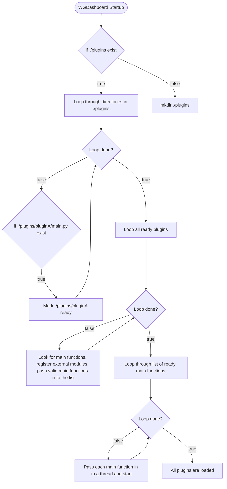

# WGDashboard Plugins

For list of available plugins: [WGDashboard/WGDashboard-Plugins](https://github.com/WGDashboard/WGDashboard-Plugins)

## Requirements
WGDashboard v4.3+

## How to install
1. Using `git clone https://github.com/WGDashboard/WGDashboard-Plugins.git` or download the repo with this [link](https://github.com/WGDashboard/WGDashboard-Plugins/archive/refs/heads/main.zip)
2. Copy the plugin folder you want into `WGDashboard/src/plugins`
3. Restart WGDashboard to load the new plugin

## How WGDashboard load plugins?



## How to write your own plugin?
I've designed it so is super easy to do it. Every plugin will get load into a thread when WGDashboard starts. You just need to do the following step:

1. Create a new folder in `WGDashboard/src/plugins`, make sure your folder name **does not contain spaces**
2. In the folder create a Python file called `main.py`. This file will be the entry point of your plugin.
3. In your `main.py`, create a function called `main` that takes in **1** parameter, which is a dictionary containing all your WireGuard configurations.
    ```python
    # main.py
    def main(WireguardConfigurations: dict[str, object] = None):
       pass
    ```
    - This would allow you to read the latest data of your WireGuard configurations.

4. That's it, you can now do whatever you want, but make sure you understand what you're doing. You can look into the `plugin_template`

## Want to submit your plugin?

We always welcome users to contribute to our project! Please make a PR in this repo and we will review it :)