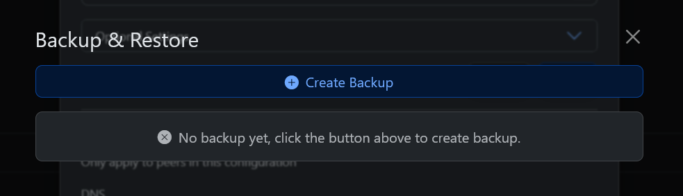
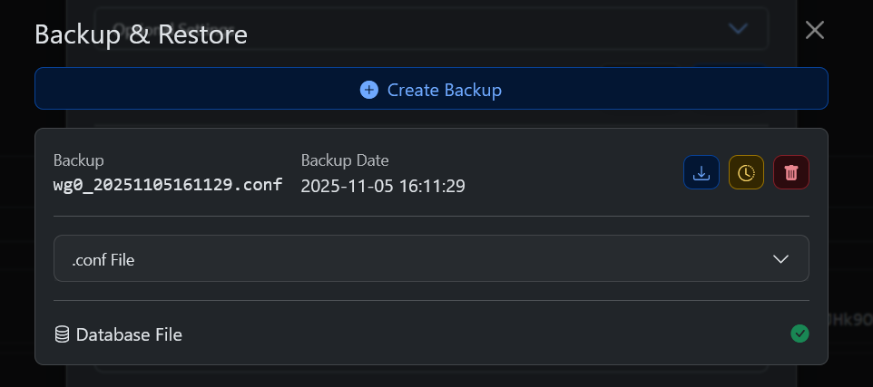

# Backup and Restore

WGDashboard allows users/admins to backup and restore WireGuard configurations.  
This guide serves as a basic usage instruction.  

## Backing-up

The way we can make a backup is to navigate to:

1. Your targeted configuration
2. `Configuration Settings`
3. `Backup & Restore`

Then you will be presented with the main backup dialogue window.  
This window will be empty on first encounter (unless scripts or other tasks have acted).  



To create a backup, simply click the button which says `Create Backup`.  
This will create copies of the current database contents and configuration file into: `/etc/wireguard/WGDashboard_Backup`.  

See:  



Correlates to:  

```
wgdashboard:/etc/wireguard/WGDashboard_Backup# ls -l

total 8
-rw-------    1 root     root           493 Nov  5 16:11 wg0_20251105161129.conf
-rw-r--r--    1 root     root           488 Nov  5 16:11 wg0_20251105161129.sql
```

The download button which should be available on each created backup will download a .zip file with both files per configuration.  

## Restore

If you want to restore a backup from the files which have been obtained through the above method.  
Both from a different system and on the same system - the steps are the same.  
First off, extract a possible archive (zip, 7z, tar.gz) so you have the two standalone files (per configuration).  

Place them into the `/etc/wireguard/WGDashboard_Backup`.  
This should create a situation which is very similar to just having created a backup.  

Back in the Web-interface, check out the before-mentioned `Backup & Restore` tab again.  
You should see the that the files you have placed have created a dialogue - with a restore option.  
This restore option reverts the current configuration to the state inside the files.

See the video as an example:  

</img>

<toc></toc>